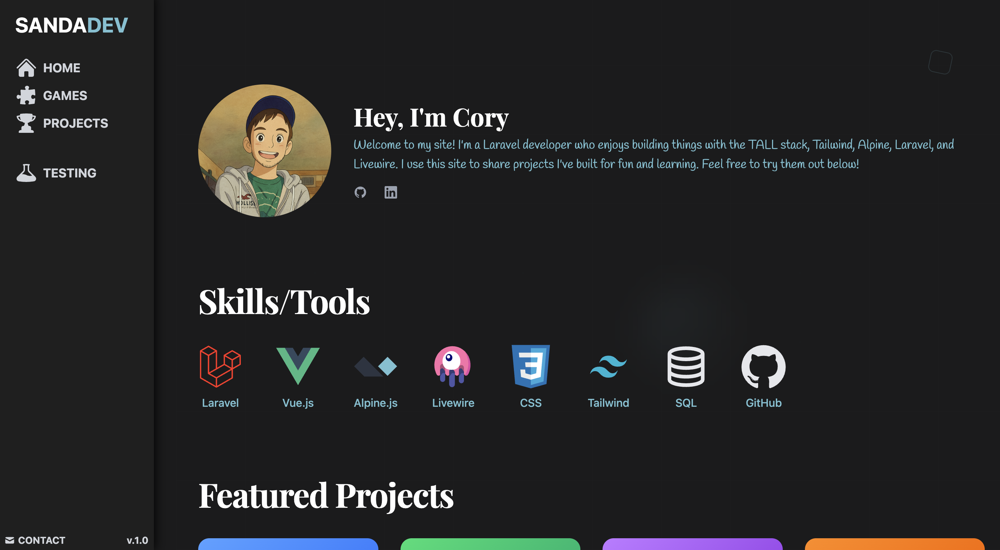
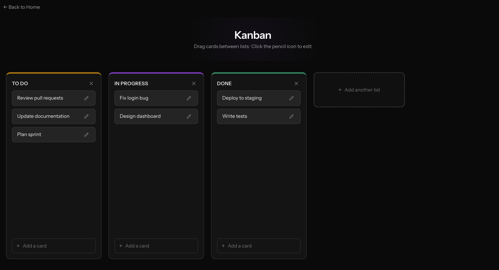
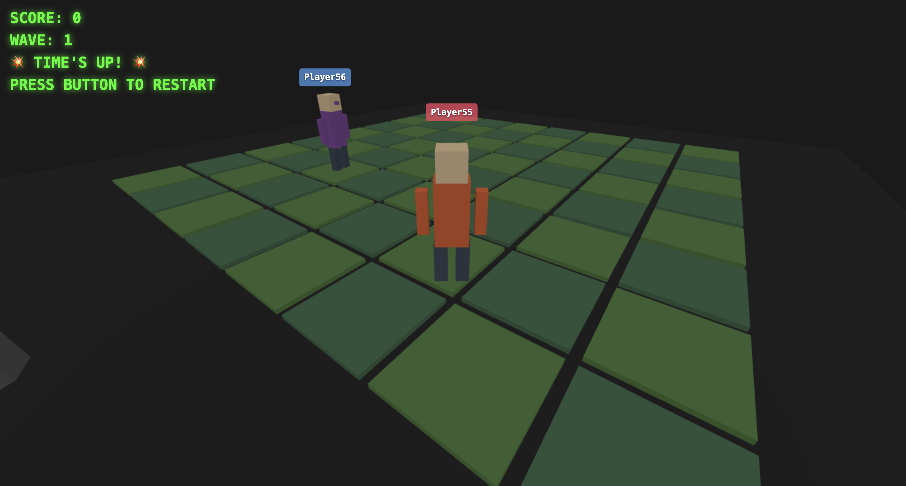
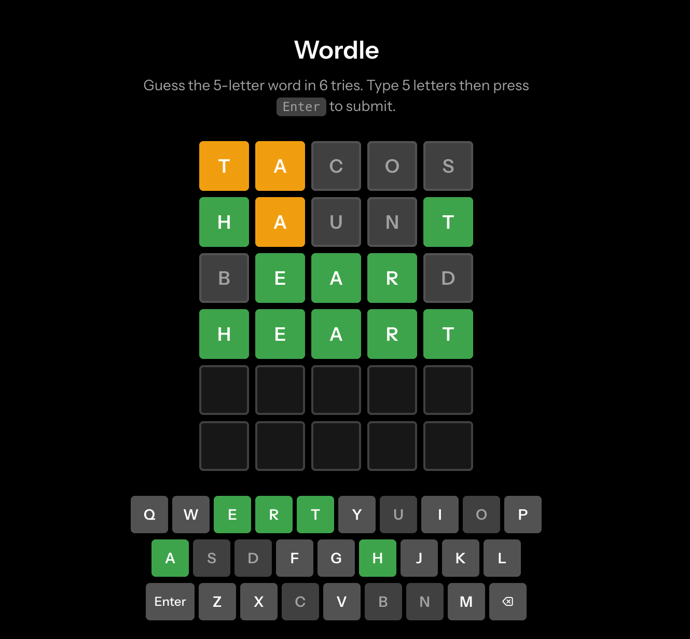
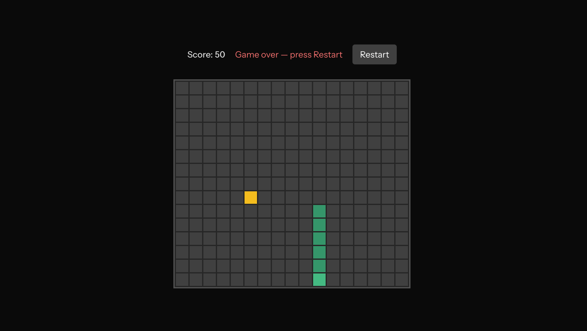
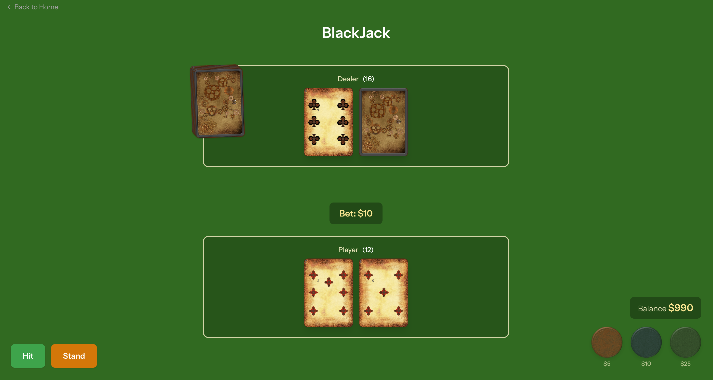

# Personal site & portfolio

Full-stack Laravel application that serves as a portfolio home page and a playground for small interactive demos: React Three Fiber scenes, classic browser games, and a realtime multiplayer prototype backed by **Laravel Reverb**.

## Stack

| Layer | Technology |
|--------|-------------|
| Backend | [Laravel 12](https://laravel.com), PHP 8.2+ |
| Frontend | [Inertia.js](https://inertiajs.com) + [React 19](https://react.dev) + [TypeScript](https://www.typescriptlang.org) |
| Styling | [Tailwind CSS v4](https://tailwindcss.com) (Vite plugin) |
| Build | [Vite 7](https://vitejs.dev) |
| 3D | [Three.js](https://threejs.org), [@react-three/fiber](https://docs.pmnd.rs/react-three-fiber), [@react-three/drei](https://github.com/pmndrs/drei) |
| Realtime | [Laravel Reverb](https://reverb.laravel.com), Laravel Echo, Pusher protocol |
| Routing (TS) | [Laravel Wayfinder](https://github.com/laravel/wayfinder) |
| Tests | [Pest 4](https://pestphp.com) |

## Features

### Landing / welcome

The home page is a single Inertia route: hero, animated UI accents, **project cards** (same previews as below), skills / tools, optional timeline, and links out. Project tiles deep-link into each demo or the Cube2 lobby.

---

### Project demos (`/projects/{id}`)

Each demo is registered in `routes/web.php` and rendered through a shared Inertia **project demo** shell. Thumbnails match the **welcome** project grid (`resources/js/pages/welcome.tsx`).

#### Racing Game — `/projects/2`

Interactive 3D scene built with **Three.js** and **React Three Fiber** (orbit-style camera: drag to rotate, scroll to zoom).

#### Kanban — `/projects/1`

Simple board: add tasks and drag them between columns (in-memory only).

#### Multiplayer (Cube2 lobby) — `/projects/cube2/lobby`

Entry point for the **Cube2** wave-tile prototype; the welcome card links here instead of a static `/projects/5` page.

#### Wordle — `/projects/3`

Guess the five-letter word in six tries with familiar green / yellow feedback.

#### Snake — `/projects/4`

Classic Snake: arrow keys, grow by eating dots, avoid walls and yourself.

#### Blackjack — `/projects/6`

Play a full round against the dealer toward 21.

---

### Cube2 (`/projects/cube2`)

Server-backed routes under `/projects/cube2` handle join, move, and leave. Realtime lobby and presence expect **Reverb** (and matching `.env` broadcast settings) when you want live updates—not required for the static demos above.

---

### Lobbies (`/multiplayer`)

Generic lobby list and room flows used to experiment with **presence** and joining games (wired toward the multiplayer work above). Handy when validating Echo + Reverb end-to-end.

---

### Broadcast smoke test (`/test-broadcast`)

Small page plus a send route to fire a test broadcast—useful to confirm WebSockets and Reverb when `BROADCAST_CONNECTION=reverb` is enabled.
